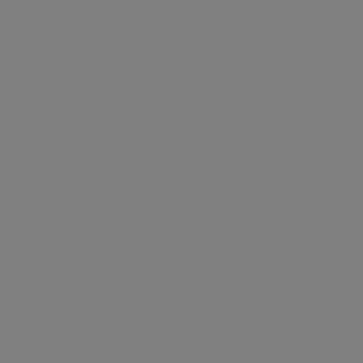
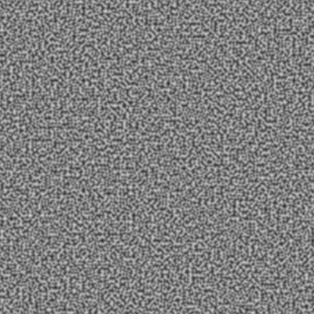
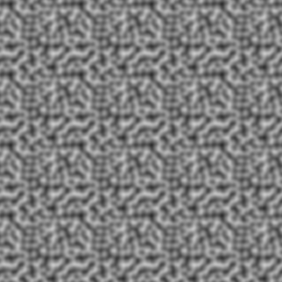
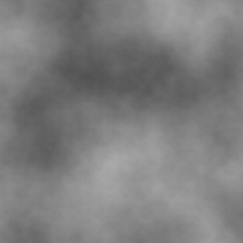
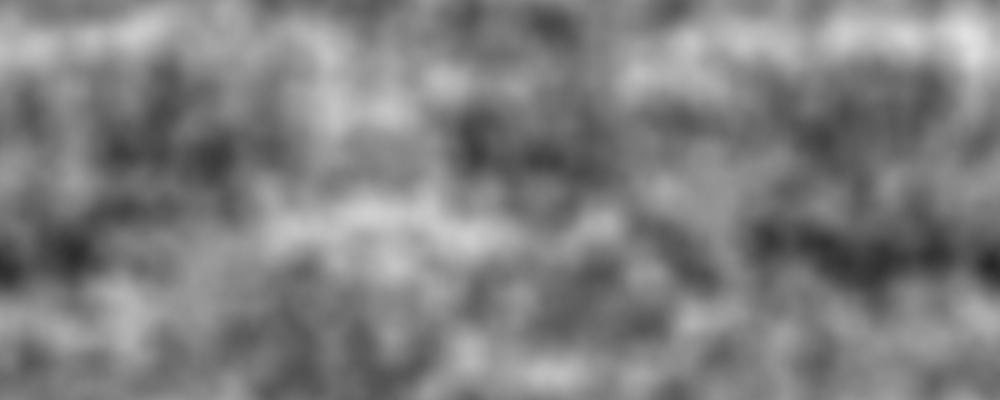
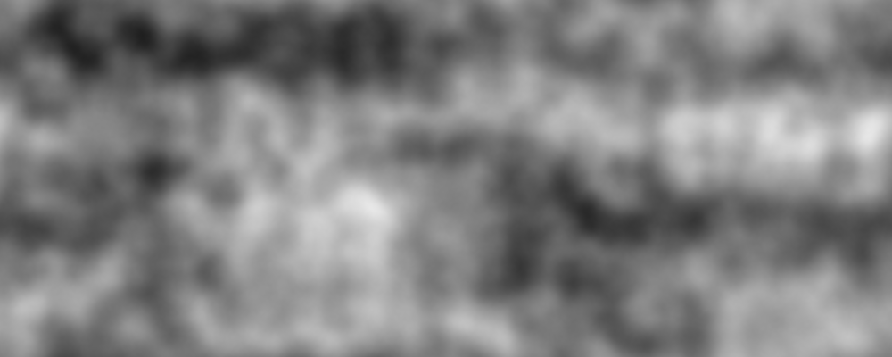

# atlas-vector-noise

An implementation of 2D perlin noise, used to generate more natural-looking noise compared to value noise.

[](https://travis-ci.org/atlassubbed/atlas-vector-noise)

---

## install 

```
npm install --save atlas-vector-noise
```

## why

[Value noise](https://github.com/atlassubbed/atlas-scalar-noise#readme) uses randomly fixed scalars on a lattice to generate interpolated noise values for points in between the lattice points.

Perlin noise uses a vector field instead, specifying not the value of the noise at the lattice points, but the gradient (i.e. how the noise changes at the lattice points). Perlin noise was invented by Ken Perlin in 1983 because value noise tends to be blocky and looks very digital. Perlin noise looks much more "natural" and its features tend to adhere to a desired frequency.

I suggest reading the docs for [atlas-scalar-noise](https://github.com/atlassubbed/atlas-scalar-noise#readme) before continuing in this section, since Perlin noise builds upon value noise. If you look at the source code for both of these modules, you'll find that Perlin noise and value noise have very similar implentations.

There's only one big difference between the two implementations. With value noise, our grid points are *scalars*, so we just skip right to interpolation. With Perlin noise, our grid points are *vectors*, meaning we have to turn them into scalars before we do the interpolation step. Perlin noise is pretty simple: it uses dot products between the grid vectors and the relative position vectors to derive the desired scalars.

## examples

### generating a grid

Perlin noise requires a random grid to work. The grid defines random gradients at various points in your image. All of the values in between are implied with linear interpolation and quintic smoothing. Smoothing helps remove unwanted artifacts in the output image.

#### rectangular grid

We can generate pseudorandom rectangular grids:

```javascript
const VectorNoiseGenerator = require("atlas-vector-noise");
// generates a 100x200 grid
const rectGrid = new VectorNoiseGenerator(100, 200);
```

#### square grid

We can also generate square grids:

```javascript
...
// generates a 100x100 grid
const squareGrid = new VectorNoiseGenerator(100) 
```

### generating noise

Once we've generated our grid, we can use that grid to generate noise. The grid defines an `NxM` lattice of pseudorandom vectors. We can get pixels at the grid lattice points, and/or between them if we want. For the rest of these examples, let's assume we have a `Canvas` API which lets us generate an empty canvas, set pixels on it and print the resultant image. We'll use the square grid we created in the example above for simplicity, but feel free to play around with rectangular grids, too.

#### regular noise?

Let's try getting pixels at exactly the grid lattice points and see what happens:

```javascript
...
const largeSquareGrid = new VectorNoiseGenerator(400)
const Canvas = require("./Canvas");
const squareCanvas = new Canvas(400, 400)

for (let x = 400; x--;){
  for (let y = 400; y--;){
    // multiply noise value 255 to set greyscale val between 0 and 255
    squareCanvas.setPixel(255 * largeSquareGrid.getPixel(x, y))
  }
}
squareCanvas.print()
```

<p align="center">
  
</p>

Unlike value noise, Perlin noise will *not* generate random white noise if you are only calling `squareGrid.getPixel` at the grid's lattice points. If you look into the Perlin noise implementation, this makes sense because all of the relative position vectors collapse to zero at the lattice points, and any vector multiplied by the zero vector is zero. 

Okay, so if it should be zero then why are we seeing solid grey? Normally, Perlin noise is distributed in the range `[-1, 1]`, however in this implementation, we transform the output such that it is the range: `[0, 1]`. Thus an output of `0` in the classical implementation would result in an output of `.5` in our implemention -- which would become roughly `rgb(127,127,127)` on the greyscale in the example above. This is why our output image is a solid grey.

#### perlin noise

We can use the grid to generate pixels in between the lattice points, giving us proper Perlin noise. In order to get pixels in between the lattice points, we need to increment our `x` and `y` values by amounts less than one. We can divide our `x` and `y` values by a scale factor. A scale factor of `4` tells the generator that we are interested in interpolating 3 brand new values in between every grid point. The `x` values will be: `[0, .25, .5, .75, 1, ..., 99, 99.25, 99.5, 99.75]` for a total of 400 values. This is also true for the `y` values, since our grid is a square.

```javascript
...
const size = 400;
const scaleFactor = 4;
const squareCanvas = new Canvas(size, size);
for (let x = size; x--;){
  for (let y = size; y--;){
    squareCanvas.setPixel(
      255 * squareGrid.getPixel(x/scaleFactor,y/scaleFactor)
    )
  }
}
squareCanvas.print()
```

<p align="center">
  
</p>

As you can see, we've just created some high-frequency Perlin noise. If you compare it to value noise of the same frequency, you'll notice it looks more rounded and less blocky, kind of like little worm-holes (not the gravitational ones) or slug tracks or something.

#### better perlin noise

The reason why the example above still looks pretty much like white noise is that we aren't interpolating enough values in between our grid points. The more we interpolate, the smoother the output image will look. In this example, we will use a smaller grid and interpolate more values in between the lattice points, while keeping our canvas a square of size `400`.

```javascript
...
const smallSquareGrid = new VectorNoiseGenerator(10)
const size = 400;
const scaleFactor = 40;
const squareCanvas = new Canvas(size, size);
for (let x = size; x--;){
  for (let y = size; y--;){
    squareCanvas.setPixel(
      255 * smallSquareGrid.getPixel(x/scaleFactor,y/scaleFactor)
    )
  }
}
squareCanvas.print()
```

<p align="center">
  
</p>

That looks more like it! Since our scale factor is *larger* and we *divide* our `x` and `y` values by it, more points will be generated in between each grid point. Namely, there will be 39 interpolation points between every grid lattice point, as opposed to only 3 in the previous example. For example, our new `x` values are: `[0, .025, .05, ..., 9.925, 9.95, 9.975]` for a grand total of 400 values. This is also true for the `y` values, since our grid is a square. 

As you can see, our features are much larger and it looks much smoother. I've always thought that Perlin noise looked kind of like a blurry sattelite photo of rolling hills.

#### infinite perlin noise

You might we wondering what happens if we try to generate noise for `x` and `y` values which are not inside of our grid. For example, if we have a grid of size `10x10`, what happens if we try `grid.getPixel(11,11)`? This is outside of our grid, so will it work? Let's try it using our small square grid with a smaller scale factor:

```javascript
...
const size = 400;
const scaleFactor = 10;
const squareCanvas = new Canvas(size, size);
for (let x = size; x--;){
  for (let y = size; y--;){
    squareCanvas.setPixel(
      255 * smallSquareGrid.getPixel(x/scaleFactor,y/scaleFactor)
    )
  }
}
squareCanvas.print()
```

<p align="center">
  
</p>

It took me 20+ iterations to get the image above. I was trying to get an image that had obvious repetition. One thing to note about Perlin noise is that the features tend to be much more regular than those in value noise, so it's harder to notice patterns.

Can you find the feature that looks like a six-pack? Notice how the six-pack feature repeats itself in both dimensions. This is because `VectorNoiseGenerator` implements periodic boundary conditions -- if you try and reach for a pixel that isn't inside the grid's boundary, it will "wrap around" and get the value from the beginning of the grid. To answer the question above, if we have a grid size of `10x10` and try `grid.getPixel(11,11)`, we would really just be getting the value of `grid.getPixel(1,1)`.

To understand why this example tesselated 4 times in each dimension, we need to look at our scale factor. It was reduced from `40` to `10` *without* changing our canvas size, meaning the `x` values become: `[0, .1, .2, ..., 39.7, 39.8, 39.9]` for a total of 400 points. This is also true for the `y` values, since our grid is a square. Notice how we almost go up to `40` in both dimensions -- meaning we are "wrapping" around our `10x10` grid three extra times.

This tesselation is useful when you want to indefinitely continue noise in some direction.

#### fractal perlin noise

Now that we understand how to generate Perlin noise, let's create a gas cloud. Fractal noise is where you reduce contributions from higher frequency signals according to a power law, as opposed to white noise which has a uniform contribution from all frequencies:

```javascript
...
const makeGrid = () => new VectorNoiseGenerator(10)
const size = 400;
// scale factors should add up to 400 
// so we're not getting an artificially dark image
const scaleFactors = [200, 100, 50, 20, 12, 8, 6, 4];
const grids = Array(scaleFactors.length).fill().map(makeGrid)
const squareCanvas = new Canvas(size, size);

for (let x = size; x--;){
  for (let y = size; y--;){
    const noiseValue = scaleFactors.reduce((p, factor, i) => {
      const frequency = size/factor;
      const smallSquareGrid = grids[i]
      return p + smallSquareGrid.getPixel(x/factor, y/factor)/frequency
    }, 0)
    squareCanvas.setPixel(255 * noiseValue)
  }
}
squareCanvas.print()
```

<p align="center">
  
</p>

This is what pink Perlin noise looks like -- if you compare it to the example in [atlas-scalar-noise](https://github.com/atlassubbed/atlas-scalar-noise#readme), it looks very similar. However, after many interations, you start to realize that Perlin noise tends to produce less artifacts than value noise, and tends to look smoother and slightly more natural than value noise.

#### mountain ranges

In our final example, we'll use Perlin noise to generate a picture which looks a lot like a bird's eye view of a rocky mountain range:

```javascript
...
// for brevity
const Grid = VectorNoiseGenerator;
const canvas = new Canvas(1000, 400);

// mountain aspect ratio is 1:1, canvas is 5:2
// this mismatch will horizontally "stretch" the mountains
const mountains = new Grid(4);
// details all have 5:2 aspect ratios
const hills = [new Grid(20, 8), new Grid(20, 8)];
const rocks = [new Grid(50, 20), new Grid(50, 20)];
const weather = [new Grid(200, 80), new Grid(200, 80)];

// xScaleFactor * xGridSize === width (1000)
// yScaleFactor * yGridSize === height (400)
for (let x = 1000; x--;){
  for (let y = 400; y--;){
    const noiseValue = 
      // add main mountain range shape
      mountains.getPixel(x/250, y/100) + 
      // add random hills
      .4 * hills[0].getPixel(x/50, y/50) - 
      // subtract different hills
      .4 * hills[1].getPixel(x/50, y/50) +
      // add scattered rocks
      .05 * rocks[0].getPixel(x/20, y/20) -
      // subtract different rocks
      .05 * rocks[1].getPixel(x/20, y/20) + 
      // add fine-grained weathering and damage
      .01 * weather[0].getPixel(x/5, y/5) - 
      // subtract different fine-grained weathering
      .01 * weather[1].getPixel(x/5, y/5)

    squareCanvas.setPixel(255 * noiseValue)
  }
}
squareCanvas.print()
```

<p align="center">
  
</p>

The first thing to note is how we're adding different "features" together. You can think of Perlin noise as having a certain frequency, depending on how large the underlying grid is and how many points you interpolate between each lattice point. When you are thinking about how to replicate something in the real world with Perlin noise, it helps to break down the real-world example as a sum of different frequency components. For example, mountain ranges tend to have large features like hills and smaller features like jagged rocks and gravel. Many functions can be decomposed as a sum of frequencies, thaks to Fourier decomposition.

You might notice how we added and subtracted equal amounts of `hills`, `rocks`, and `weather`. This was done to add a ruggedness to the texture of the mountain range. If we were to only add these components, the range would look less rocky and more smooth. The `mountains` grid has a 1:1 aspect ratio so that it stretches by a factor of `2.5` when rendered on a `1000x400` canvas, making it feel more like a long, contiguous mountain range than just a random assortment of bumps. Take a look at the larger valleys and peaks and notice how they tend to continue for a while on the horizontal axis:

<p align="center">
  
</p>

This "mountain" example is just the beginning! Go ahead and Google "perlin noise" to see all the kinds of awesome stuff you can generate with Perlin noise.

## caveats 

#### optimization

Perlin noise can be optimized by limiting the possible gradient vectors and doing clever bitwise operations. This module does not implement any of these optimizations. Doing these optimizations in javascript might be an act of futility, anyway. This module is mainly for educational purposes and fun.

#### distribution

By default, Perlin noise is non-uniformly distributed in `[-1, 1]`. The Perlin noise output from this module is incremented by one and then halved so that it lies in `[0, 1]`. If your images don't have enough values near the extrema, it's because Perlin noise tends to be closer to the mean value (`.5` in this module); very rarely do you get values close to the ends of the interval. You can manually restrict the boundary to `[.2, .8]` if you want to see more noise values closer to the endpoints.
